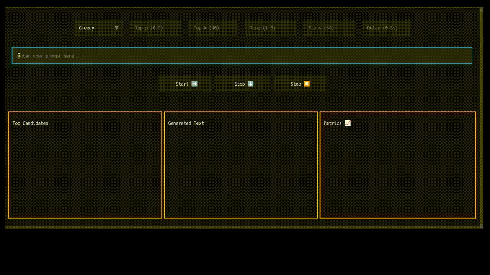

# InferDecode

Interactive visualization tool for LLM decoding strategies.

## Features

- Visualize different decoding strategies (greedy, top-k, top-p, etc.)
- Step-by-step token generation visualization
- See top candidate tokens and their probabilities
- Performance metrics tracking

## Installation

```bash
pip install inferdecode
